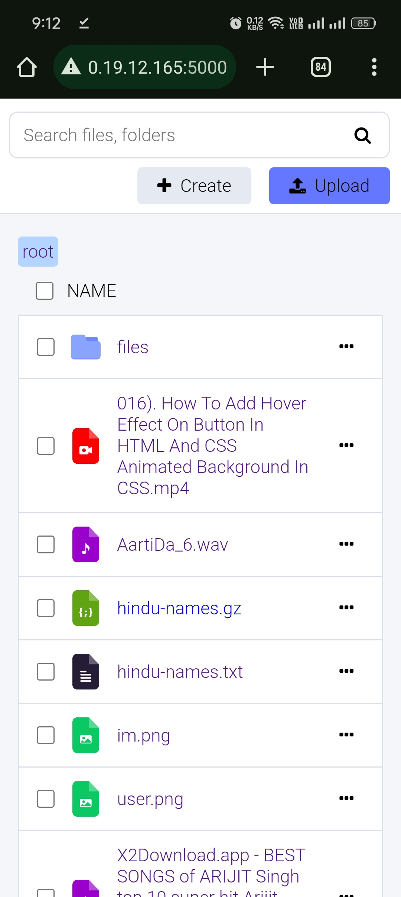
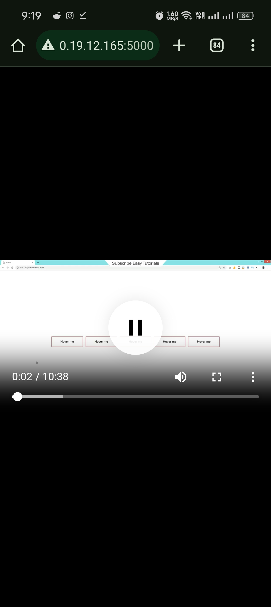
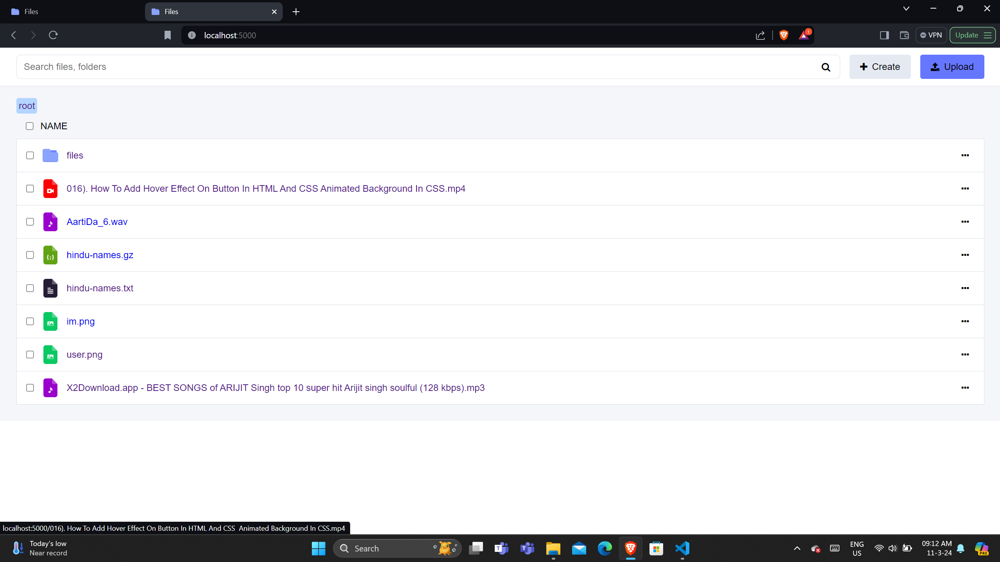
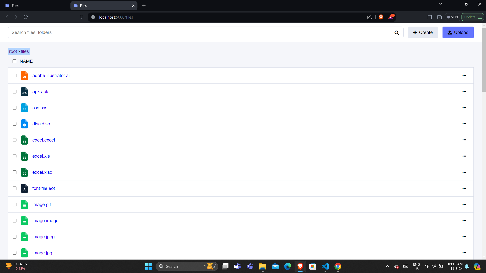

# Web-File-Explorer

Welcome to my Online File Manager Showcase! This project demonstrates my skills in building an online file manager application. It allows users to manage their files efficiently through a user-friendly web interface.

video demo [instagram](https://www.instagram.com/p/C4WSZiqINrn/)

## Features

- **File Navigation**: Navigate through directories and view files.✅
- **File Upload**: Easily upload files of various formats.✅
- **File Management**: Perform operations like rename, delete, and move files.❌
- **Media Viewing:** View videos, PDFs, and listen to music files within the application.❌
- **User Authentication**: Secure access with user authentication.❌

## Technologies Used

- Frontend: HTML, CSS, JavaScript
- Backend: Python (Flask)

## How to Use

1. Clone this repository.
2. Install the necessary dependencies.
3. Run the application locally using Flask.
4. Access the application in your web browser.

## Screenshots

### Mobile View

  
  
  

### Laptop View

  
  

## Contributing
Contributions are welcome! If you have any ideas, enhancements, or bug fixes, please open an issue or submit a pull request. For major changes, please open an issue first to discuss the proposed changes.

Feel free to modify and expand upon this template to better suit your project's specific details and requirements!
